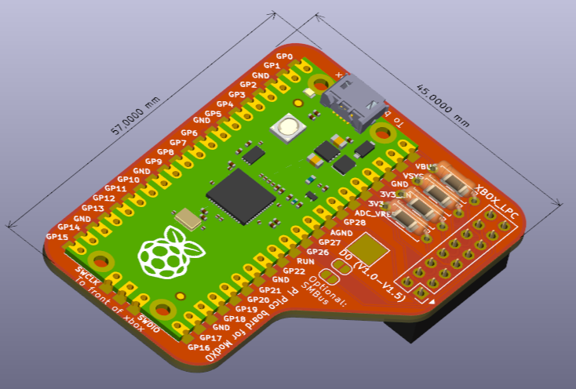
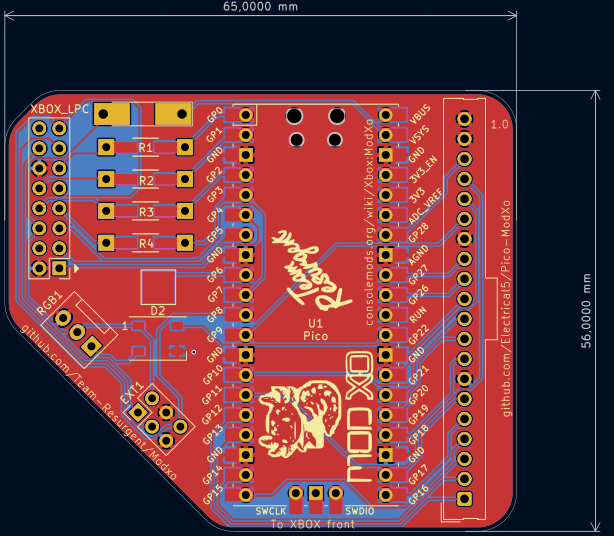
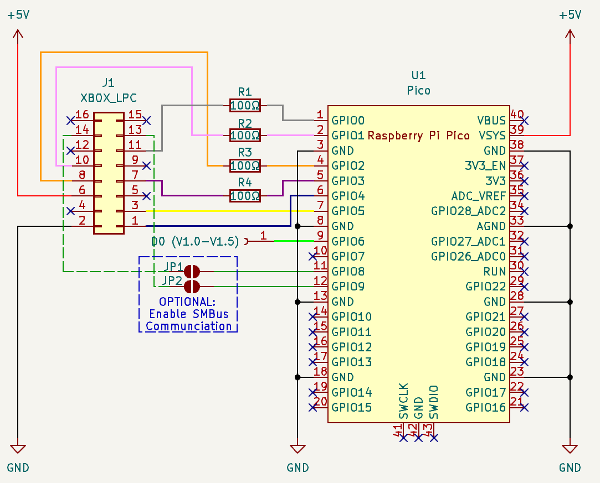

# Pi Pico modchip adapter for Original Xbox

Currently working on support for V1 version by ['Team Resurgent'](https://github.com/Team-Resurgent/Modxo)

See the [V0.2](https://github.com/Electrical5/Pico-ModXo/tree/V0.2) for the support of the original "[ModXo](https://github.com/shalxmva/modxo)" by Shalx

TODO's:
* running DRC and ERC to check for issues.
* Check ground plane under Pi Pico usb port, think it needs some exclusion zones.
* Check part numbers to create a decent bill-of-material (though not sure about which connectors to actually use?)
* Clean up the silkscreen a bit, add some 'to Xbox front' as indication and reference to the related GitHub and ConsoleMods pages.
* Update readme to reflect all changes.

# Easy to solder

All components can be soldered 'though hole' at home and the Pico/resistors also have 'surface mount' options, making it ideal for hobbyists or mass production.

# Fully open source

The KiCad (free application) source files (full schematics!) are included, so you can add/remove components based on your preferences.

# SMBus

Currently ModXo doesn't implement reading SMBus via I2C, in the future this could add functionality such as monitoring temperature/fanspeed, LED control or restarting/shutdown the xbox remotely.
Especially if paired with the Pi Pico Wireless, it could allow basic remote control / monitoring of the xbox.
However, there's two solder jumpers to connect the SMBus of the Xbox to the Pi Pico.

# License

GNU GENERAL PUBLIC LICENSE
Version 3, 29 June 2007

You can sell this board as-is, but disclose the source.
If you sell modifications of this board (additional headers for LED strips / LCD / fan), share the modifications / source files under the same license.

# More info

https://github.com/shalxmva/modxo
https://consolemods.org/wiki/Xbox:ModXo
